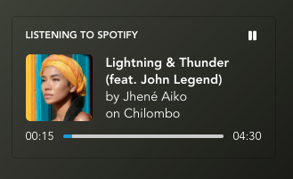

# PresenceBot
Lightweight REST API for retrieving the presence of a set list of Discord users.

## Getting Started
PresenceBot is easy to deploy. My favorite method for maintaining an active process is pm2, though the process is unlikely to die, so you could run it in a detached screen if you watned.

1. Clone the latest version of PresenceBot using `git clone https://github.com/EricRabil/PresenceBot.git`
2. Initialize the modules using `npm i`
3. Initialize the service by running `node js/run.js`
4. The service will generate a `config.json` file in the root of the `PresenceBot` directory - the default port is `8138`, and tokens are currently stored in this file. *I am planning on moving tokens to a database with a REST API for managing them.*
    
    1. In the users object of the `config.json` file, this is the schema:
    ```json
    {
      "users": {
        "token": "name"
      }
    }
    ```
    2. Choose a secure token (this is your responsibility) and enter a name for this "user" (or scope).
    3. Save the file.
5. Now that you've configured the service - here are some ways you can run it:
    - `pm2 start js/run.js --name=presenti`
    - `screen -S presenti "node js/run.js"`
    - `node js/run.js`

## Streaming API

The Streaming API is for apps that are subscribing to presence data.

### WebSocket

> Currently, the Streaming API only exists on the WebSocket platform. If you have a use case for other platforms, please open an issue.

Subscribing to a presence is fairly straightforward. Simply open a connection to

`ws://{host}/presence/{name}`

Where host is the address to your server, and name is the name tied to the token.

Presence updates look like this, and are also sent upon connection:
```json
{
  "activities": [
    {
      "applicationID": "presenti",
      "assets": {
        "largeImage": "https://pbs.twimg.com/media/EVf-eJiWkAEqgNG?format=jpg&name=small",
        "largeText": "Go To Town",
        "smallTexts": [
          "Doja Cat"
        ]
      },
      "name": "YouTube",
      "timestamps": {
        "start": "2020-04-16T03:52:21.173Z",
        "end": "2020-04-16T03:52:28.823Z"
      },
      "type": "WATCHING",
      "data": {
        "largeTextLink": "https://www.youtube.com/watch?v=TLiGA_wrNp0",
        "smallTextLinks": [
          "https://www.youtube.com/channel/UCzpl23pGTHVYqvKsgY0A-_w"
        ],
        "imageLink": "https://www.youtube.com/watch?v=TLiGA_wrNp0"
      }
    }
  ]
}
```

These are the only messages that will be sent by the server. If the connection closes, simply re-open the connection. There is no authentication necessary for this endpoint.

## Presence API

The Presence API is for apps that are providing presence data to the service.

### REST

The REST API is useful for platforms in which it is not feasible to maintain a WebSocket connection for updating your presence.

#### New Session
`GET /session?token={your token}`

Call this endpoint with a valid token to open a new presence session. The session will remain valid for as long as the value of `expires`, in milliseconds. This is server-configurable, and you can prevent the session from expiring by calling any of the below endpoints.

*Example Response*
```json
{
  "sessionID": "34e7f94b-7fa3-4196-912a-88186b25299d",
  "expires": 10000
}
```

#### Update Presence
`PUT /session?token={token}&id={sessionID}`

Call this endpoint to update the presence state for the session. Calling this endpoint doubles as a session refresh, resetting the time until session expiration.

*Example Request*
```json5
{
  "presences": [
    {
      "title": "Listening to Spotify",
      "largeText": {
          "text": "Issues/Hold On",
          "link": "https://open.spotify.com/track/0bxmVPKnEopTyuMMkaTvUb"
      },
      "smallTexts": [
          {
              "text": "by Teyana Taylor",
              "link": "https://open.spotify.com/artist/4ULO7IGI3M2bo0Ap7B9h8a"
          },
          {
              "text": "on K.T.S.E.",
              "link": "https://open.spotify.com/album/0mwf6u9KVhZDCNVyIi6JuU"
          }
      ],
      "image": {
          "src": "https://i.scdn.co/image/ab67616d0000b273abca6b34e370af95f3b926bd",
          "link": "https://open.spotify.com/track/0bxmVPKnEopTyuMMkaTvUb"
      },
      // unix timestamp representing start/stop of media, omit for no timer
      "timestamps": {
          "start": 1587431026177,
          "stop": 1587431296243
      },
      // if you would like a gradient background to be generated for this presence, set enabled to true.
      // if you dont need a gradient, you can omit this or set it to null.
      "gradient": {
          "enabled": true,
          // priority can be increased to take precedence over other gradient presences
          "priority": 0
      },
      "isPaused": true,
      "effective": 1587420294386
    }
  ]
}
```

This is how that would be rendered


*Example Response*
```json
{
  "ok": true
}
```

#### Refresh Session
`PUT /session/refresh?token={token}&id={sessionID}`

Call this endpoint to prevent the session from expiring, but don't have an updated payload to send.

*Example Response*
```json
{
  "ok": true
}
```

### WebSocket

The WebSocket API is useful for dedicated presence servers that will be sending a large or unknown amount of data.

#### An Overview
The WebSocket API follows the following general schema when exchanging data

```json
{
  "type": 0,
  "data": []
}
```

#### Type Codes
These are the valid codes that may be sent or received over the WebSocket API.
|Code|Name|Description|Sender|Response?|
|-|-|-|-|-|
|0|Ping|Pings the server|Client|✅|
|1|Pong|Sent upon ping|Server|❎|
|2|Presence|Updates presence, where the data property is an array of presence objects|Client|❎|
|3|Identify|Authenticates session, where the data property is the user token|Client|✅|
|4|Greetings|Sent by the server, upon successful authentication. Start sending pings after receiving greetings.|Server|❎|

#### Example messages

##### Identify
Sent upon connection open, this identifies the session for the server.
```json
{
  "type": 3,
  "data": "{token}"
}
```

##### Ping
Though not required, these can help prevent a connection time-out and unnecessarily reconnecting.
```json
{
  "type": 0
}
```

##### Presence Update
```json5
{
  "type":2,
  "data": [
    {
      "title": "Listening to Spotify",
      "largeText": {
          "text": "Issues/Hold On",
          "link": "https://open.spotify.com/track/0bxmVPKnEopTyuMMkaTvUb"
      },
      "smallTexts": [
          {
              "text": "by Teyana Taylor",
              "link": "https://open.spotify.com/artist/4ULO7IGI3M2bo0Ap7B9h8a"
          },
          {
              "text": "on K.T.S.E.",
              "link": "https://open.spotify.com/album/0mwf6u9KVhZDCNVyIi6JuU"
          }
      ],
      "image": {
          "src": "https://i.scdn.co/image/ab67616d0000b273abca6b34e370af95f3b926bd",
          "link": "https://open.spotify.com/track/0bxmVPKnEopTyuMMkaTvUb"
      },
      // unix timestamp representing start/stop of media, omit for no timer
      "timestamps": {
          "start": 1587431026177,
          "stop": 1587431296243
      },
      "gradient": {
          "enabled": true
      },
      "isPaused": true,
      "effective": 1587420294386
    }
  ]
}
```

This is how that would be rendered


## Pre-requisites
- Node 12
- node-gyp capable device